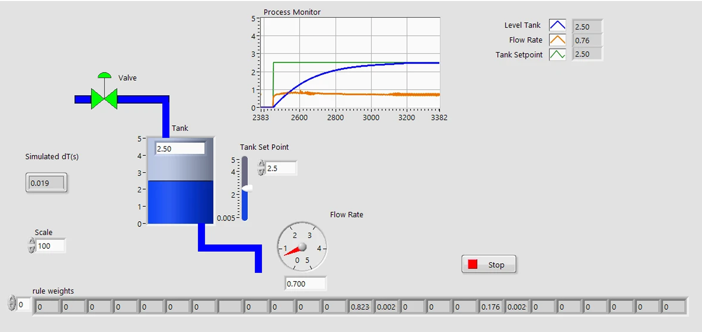
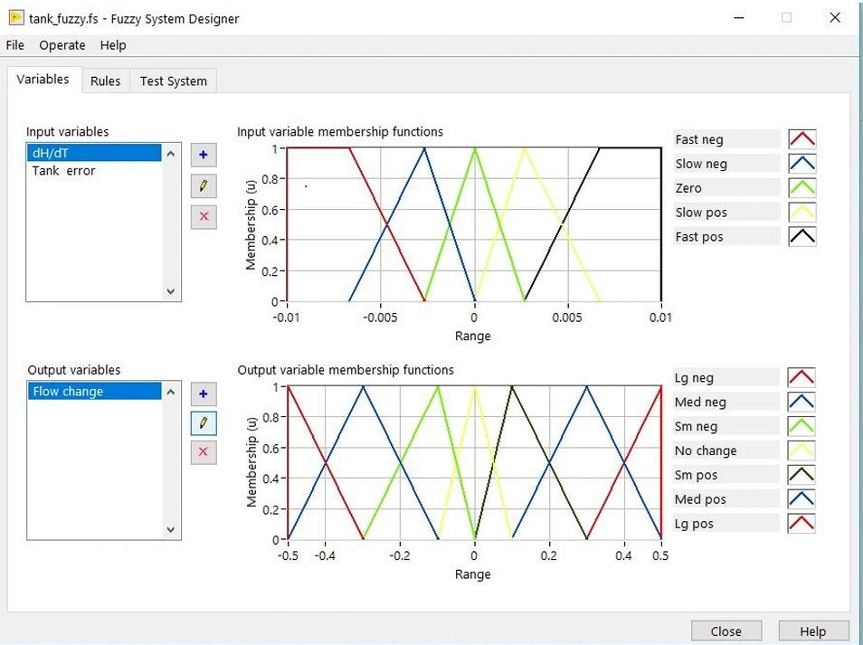
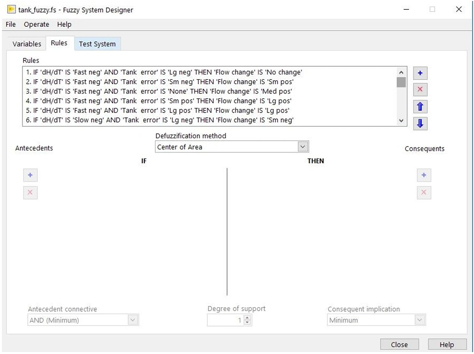
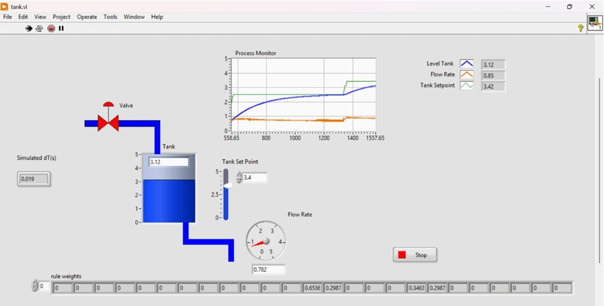
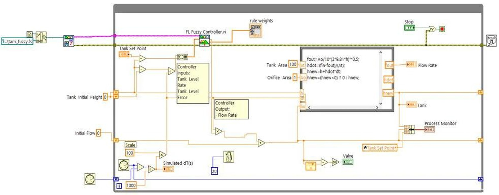

# Real-Time Simulation and Control of a Water Tank System Using Fuzzy Logic in LabVIEW

A real-time fuzzy logic controller developed in **LabVIEW** for automatic water tank level regulation. The controller dynamically adjusts the inlet flow rate using linguistic IF–THEN rules, providing stable level control without requiring an accurate mathematical model. The project demonstrates the practical application of fuzzy logic for real-time process control of nonlinear dynamic systems.

  

<b>Figure 1.</b> Real-time fuzzy logic water tank control system developed in LabVIEW.

## Project Highlights

- 💧 Real-time water tank level regulation using a **Fuzzy Logic Controller**.
- ⚙️ Implemented entirely in **LabVIEW** with an interactive Front Panel and Block Diagram.
- 🧠 Rule-based decision making without requiring an accurate mathematical model.
- 📊 Dynamic visualization of tank level, inflow, and control response.
- 🎯 Smooth and stable water level control with reduced overshoot.
- 🧪 Designed as an educational and practical implementation of intelligent process control.

## Overview

Maintaining the water level of industrial storage tanks is a fundamental control problem in many engineering applications. Conventional controllers often require accurate mathematical models and may experience performance degradation when system dynamics become nonlinear or uncertain.

This project presents a **real-time fuzzy logic-based water tank control system** developed in **LabVIEW**. The controller continuously monitors the tank level, evaluates the control error using linguistic IF–THEN rules, and dynamically adjusts the inlet flow to maintain the desired water level.

The proposed system demonstrates how fuzzy logic can provide stable and reliable control without requiring an exact mathematical model, making it a practical solution for nonlinear process control and an effective educational example of intelligent control systems.

## Problem Statement

Water tank level regulation is a challenging control problem due to the nonlinear behavior of fluid dynamics and continuously changing operating conditions. Traditional control methods often require accurate mathematical models and may not achieve satisfactory performance when system parameters vary.

Fuzzy Logic Control provides an effective alternative by incorporating human expertise through linguistic IF–THEN rules instead of relying on precise mathematical equations. This approach enables smooth control actions, improved robustness, and stable water level regulation under varying operating conditions.

## Fuzzy Logic Controller

The controller was designed using the **LabVIEW Fuzzy System Designer** to regulate the water tank level through human-like decision making. Instead of relying on an exact mathematical model, the controller evaluates the system state using linguistic variables and a predefined set of IF–THEN rules.

The fuzzy controller consists of four main stages:

- **Fuzzification** – Converts numerical inputs into linguistic variables.
- **Rule Base** – Applies expert-defined IF–THEN control rules.
- **Inference Engine** – Evaluates the activated rules and determines the control action.
- **Defuzzification** – Converts the fuzzy output into a crisp flow adjustment using the **Center of Area (Centroid)** method.

### Membership Functions

The controller uses two input variables:

- **Tank Error**
- **Rate of Change of Water Level (dH/dT)**

and one output variable:

- **Flow Change**

The input variables are represented by **five triangular membership functions**, while the output variable uses **seven triangular membership functions** to provide smooth and accurate flow regulation.

  

<b>Figure 2.</b> Input and output membership functions designed using the LabVIEW Fuzzy System Designer.

### Rule Base

The controller behavior is defined through a set of expert-designed **IF–THEN** rules. Each rule combines the current tank error and the rate of change of the water level to determine the appropriate inlet flow adjustment. This rule-based approach enables stable and intuitive control under different operating conditions.

  

<b>Figure 3.</b> Fuzzy rule base implemented using the LabVIEW Fuzzy System Designer.

## LabVIEW Implementation

The fuzzy logic controller was implemented in **LabVIEW** using the **Fuzzy Logic Toolkit** and executed within a deterministic real-time control loop. The application integrates the fuzzy inference system with the water tank dynamics to continuously regulate the water level toward the desired setpoint.

### Front Panel

The Front Panel serves as the Human-Machine Interface (HMI), providing real-time visualization of the water tank behavior and controller performance. It displays the tank level, target setpoint, flow rate, process trends, and fuzzy rule activation, allowing users to monitor the system interactively.

  

<b>Figure 4.</b> LabVIEW Front Panel for real-time monitoring and control.

### Block Diagram

The Block Diagram implements the complete control algorithm. It acquires the system inputs, evaluates the fuzzy controller, computes the inlet flow adjustment, updates the tank dynamics, and continuously feeds the calculated water level back to the controller, forming a closed-loop control system.

  

<b>Figure 5.</b> LabVIEW Block Diagram implementing the fuzzy logic control algorithm.

## Results

The proposed fuzzy logic controller successfully regulated the water tank level under real-time simulation. Starting from an empty tank, the system smoothly converged to the desired **2.50-unit setpoint** while maintaining stable operation throughout the simulation.

The controller demonstrated reliable performance by adapting the inlet flow according to the system state, resulting in smooth level regulation without excessive oscillations. Furthermore, the real-time visualization of fuzzy rule activation provided transparency into the controller's decision-making process and confirmed the effectiveness of the implemented rule base.

  

<b>Figure 6.</b> Real-time water tank level regulation achieved using the fuzzy logic controller.

### Key Results

- ✅ Stable regulation at the **2.50-unit** target level.
- ✅ Smooth transient response with **no overshoot**.
- ✅ Negligible steady-state error.
- ✅ Real-time fuzzy inference and rule activation visualization.
- ✅ Successful implementation using the **LabVIEW Fuzzy Logic Toolkit**.

## Repository Structure

The repository is organized into separate directories for documentation, source files, and project resources to simplify navigation and improve maintainability.

| Directory | Description |
|-----------|-------------|
| **docs/** | Complete project report and supporting documentation. |
| **images/** | Figures used throughout the README, including the fuzzy system design, LabVIEW implementation, and simulation results. |
| **labview/** | LabVIEW source files, including the main Virtual Instrument (`tank.vi`) and the fuzzy logic configuration (`tank_fuzzy.fs`). |
| **README.md** | Project overview, implementation details, results, and repository documentation. |

## Project Files

The repository includes the following core project files:

| File | Description |
|------|-------------|
| **tank.vi** | Main LabVIEW Virtual Instrument implementing the real-time water tank control system. |
| **tank_fuzzy.fs** | Fuzzy Logic Designer configuration containing the membership functions, rule base, and inference settings. |

## References

1. L. A. Zadeh, *"Fuzzy Sets,"* Information and Control, vol. 8, no. 3, pp. 338–353, 1965.

2. T. J. Ross, *Fuzzy Logic with Engineering Applications*, 3rd Edition, Wiley, 2010.

3. K. Ogata, *Modern Control Engineering*, 5th Edition, Prentice Hall, 2010.

4. K. M. Passino and S. Yurkovich, *Fuzzy Control*, Addison-Wesley, 1998.

5. National Instruments, *LabVIEW Fuzzy Logic Toolkit User Manual*, 2023.
